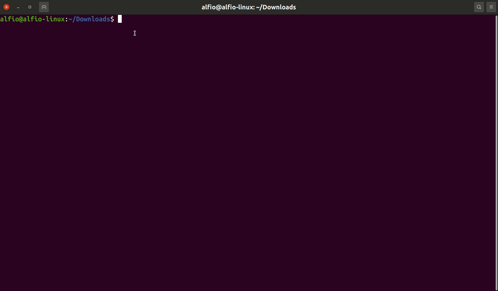

# qrcode-generator
Generate a svg qrcode from url and send the file to an email address.

# Installation
- `sudo apt update`
- `sudo apt install qrencode mailutils ssmtp`
- `sudo mv qrcode-gen /usr/bin/qrcode-gen`
- `sudo chmod +x /usr/bin/qrcode-gen`

# Usage
`qrcode-gen https://www.alfiosalanitri.it`

# Dependencies
- qrencode (https://pkgs.org/download/qrencode)
- mailutils (https://pkgs.org/download/mailutils)
- ssmtp (optional)
